# How it works

[简体中文](architecture.zh-CN.md)

```mermaid
flowchart LR
  U[Topic and time window] --> P[Plugin planner]
  P --> H[Generic host network transport]
  H --> N[News / HN / GitHub / Reddit]
  N --> F[Plugin parses, date-filters, deduplicates]
  F --> R[Relevance filter and evidence IDs]
  R --> A[Existing default AI model]
  A --> C[Citation checks and safe rendering]
  C --> S[Device history / saved EdgeEver note]
```

## Responsibilities

`src/sources.ts` runs inside the plugin bundle. Every request uses the injected `context.network.fetch`; there is no implicit global fetch, research endpoint, or separate backend. Adapters choose fixed HTTPS destinations, reject redirects, limit responses to 2 MB, and use a 20-second deadline. The plugin parses XML/JSON and produces its own evidence records. Public transport avoids browser CORS restrictions; source access restrictions and rate limits still apply.

`src/engine.ts` owns research orchestration. Quick mode sends one query to the selected sources (six hits each). All four sources are selected by default. Standard and deep modes ask the default model for up to two or three queries respectively (ten hits per source/query). Requests run in pairs. Optional Hacker News comment enrichment adds up to two requests per query. Selection is capped at 40 evidence items.

Ranking combines reciprocal source rank and query-token overlap. It reserves representatives from available sources and does not compare unlike platform engagement counts. Standard/deep runs apply one semantic relevance pass to all surviving items, including sparse results. The original topic is always retained as one query to prevent planner drift. Unknown IDs or invalid JSON fall back to local relevance. Planning failure falls back to the original topic. No model means evidence-only output.

Each item retains its original URL, publication time where available, source, excerpt, and coverage label. Query parameters used for tracking are removed for deduplication. Old/future timestamps are excluded; undated evidence stays explicitly undated. A generated `[E12]` citation can only link to a collected `E12`. This validates provenance, not semantic entailment or factual truth. Reports instruct the model to attribute headline claims rather than invent article details.

`src/ui.ts` uses a Shadow DOM panel, DOMPurify, and marked. Source excerpts are plain text. Images and embedded interactive content are excluded from displayed reports. Closing the panel keeps an active run alive; cancellation or plugin deactivation aborts requests. On reopening the app, abandoned active runs are labeled interrupted, not silently resumed.

`src/store.ts` serializes local snapshots. Notes use host `notes.create`, and repeat saves open the existing note. Follow-up answers added later are retained in history and new exports; an already saved note is a snapshot and is not silently overwritten. Watchlists use stable command IDs and the existing desktop scheduler. Daily runs retain the tracked sources and depth; legacy watches default to all sources and standard depth; only runs with evidence replace the comparison baseline. “New evidence” counts different retrieved URLs, not newly occurring events.

## Host boundary

`src/runtime.ts` builds an internal `ResearchBridge` from `context.network.fetch` and generic `context.ai.status/generate`. `ResearchBridge`, `SearchInput`, `Evidence`, platform lists, and report prompts are plugin-internal types and must not be exported by the host SDK. There is no `context.research` dependency.

The generic AI and public network contracts are implemented in the local EdgeEver development tree but have not shipped. The manifest declares `ai:generate`, `network` and `network:public`; older hosts that do not recognize these permissions reject installation. Runtime fallback without AI does not bypass manifest validation. Requests explicitly choose `transport: "public"`; ordinary browser fetch remains available for other plugins. See the [generic capability contract](host-capabilities.md) for limits and verification status.

Settings, saved notes, schedules and model credentials belong to the existing generic host services. Source queries, parsing, relevance, citations, watch comparison and report structure belong to the plugin. The removed `integration/` implementations and injection script are not part of this architecture.

## Useful boundaries for the next version

Add richer source adapters only after defining access, rate limits, and truthful coverage labels. Persistent server-side scheduling requires a separate product decision; current schedules intentionally use EdgeEver's desktop runtime. Local history is bounded and device-specific. Watchlists retain up to 40 baseline URLs separately so history eviction does not erase the next comparison. Large-scale relevance evaluation and entailment verification are future work; this version tests provenance, degraded sources, cancellation, permissions, and UI safety.

## Recovery and report limits

`src/requests.ts` enforces client deadlines even when a provider ignores cancellation: AI status 10 seconds, planning 30 seconds, relevance 45 seconds, source requests 30 seconds, and report/follow-up generation 90 seconds. Timeouts abort the child signal and release the waiting UI. Server/provider billing cancellation remains provider-dependent.

Report regeneration only reads existing evidence. It neither reruns search nor changes the original research date/window. A failed or cancelled attempt leaves the prior report and note reference intact. Saved notes remain snapshots. Evidence passed to AI is capped at 40 IDs within roughly 56,000 characters; comments and long summaries are shortened before evidence IDs are dropped. The follow-up context also bounds previous answers. English relevance tokens use word boundaries so “AI” does not match “chair”.

Source/depth preferences, report kind, and watch comparison URLs are optional additions to storage version 1. Older runs remain readable without a destructive migration. An empty new source selection is rejected. UI filters only change the display, never saved evidence or exported report coverage.

## Native settings

`manifest.json` declares six fields rendered by EdgeEver: `default.days`, `default.depth`, and `source.news` / `source.hackernews` / `source.github` / `source.reddit`. `src/settings.ts` reads `context.settings.get` with a five-second deadline and validates against the manifest. The manifest also owns fallback defaults; each failed or invalid field falls back with a visible warning. All-disabled sources remain disabled and block a new run until the user selects a source.

Every panel mount reloads defaults before exposing the research form. Reads from closed panels cannot update a newer panel, and deactivation cancels the wait. Per-panel overrides never write settings; recorded runs and watches remain snapshots. No storage migration, new permission, credential, schedule, or backend deployment is introduced. Hosts lacking `context.settings` keep the previous behavior.
