# How it works

[简体中文](architecture.zh-CN.md)

```mermaid
flowchart LR
  U[Topic and time window] --> P[Plugin planner]
  P --> H[Permission-checked EdgeEver host]
  H --> B[Existing shared EdgeEver backend]
  B --> N[News / HN / GitHub / Reddit]
  N --> F[Normalize, date-filter, deduplicate]
  F --> R[Relevance filter and evidence IDs]
  R --> A[Existing default AI model]
  A --> C[Citation checks and safe rendering]
  C --> S[Device history / saved EdgeEver note]
```

## Responsibilities

`src/sources.ts` is copied into the host's existing backend. Requests use fixed HTTPS destinations, manual redirect rejection, 20-second cancellation, and a 2 MB response limit. No generic URL proxy is exposed. The same Hono business routes run in Cloudflare and Docker; there is no research-specific deployment or database migration.

`src/engine.ts` owns research orchestration. Quick mode sends one query to four sources (six hits each). Standard and deep modes ask the default model for up to two or three queries respectively (ten hits per source/query). Requests run in pairs. Optional Hacker News comment enrichment adds up to two requests per query. Selection is capped at 40 evidence items.

Ranking combines reciprocal source rank and query-token overlap. It reserves representatives from available sources and does not compare unlike platform engagement counts. Standard/deep runs apply one semantic relevance pass when more than three items survive. Unknown IDs or invalid JSON fall back to local relevance. Planning failure falls back to the original topic. No model means evidence-only output.

Each item retains its original URL, publication time where available, source, excerpt, and coverage label. Query parameters used for tracking are removed for deduplication. Old/future timestamps are excluded; undated evidence stays explicitly undated. A generated `[E12]` citation can only link to a collected `E12`. This validates provenance, not semantic entailment or factual truth. Reports instruct the model to attribute headline claims rather than invent article details.

`src/ui.ts` uses a Shadow DOM panel, DOMPurify, and marked. Source excerpts are plain text. Images and embedded interactive content are excluded from displayed reports. Closing the panel keeps an active run alive; cancellation or plugin deactivation aborts requests. On reopening the app, abandoned active runs are labeled interrupted, not silently resumed.

`src/store.ts` serializes local snapshots. Notes use host `notes.create`, and repeat saves open the existing note. Follow-up answers added later are retained in history and new exports; an already saved note is a snapshot and is not silently overwritten. Watchlists use stable command IDs and the existing desktop scheduler. Daily runs use standard depth; only runs with evidence replace the comparison baseline. “New evidence” counts different retrieved URLs, not newly occurring events.

## Host boundary

- `context.ai.status()` returns configuration availability and model display name only.
- `context.ai.generate({system, prompt, maxOutputTokens, signal})` uses the current workspace default model through the existing AI runtime.
- `context.research.search({query, source, days, limit}, {signal})` returns a typed result and source status.
- The first two require `ai:generate`; search requires `research:search`. Calls stop after plugin deactivation.
- HTTP routes require an interactive authenticated workspace user. Generate input is bounded to 90,000 prompt characters, 8,000 system characters, 5,000 output tokens, and 120 seconds. Provider errors are redacted. Public demo AI generation is disabled.
- Per-workspace, per-isolate concurrent requests are capped at four in each AI/read group. This is a concurrency guard, not a global distributed quota or billing system.

No AI key, cookie, generic HTTP fetch, database handle, or internal React state is passed through these new methods. Existing trusted-code plugin limitations still apply.

## Useful boundaries for the next version

Add richer source adapters only after defining access, rate limits, and truthful coverage labels. Persistent server-side scheduling requires a separate product decision; current schedules intentionally use EdgeEver's desktop runtime. Local history is bounded and device-specific. Large-scale relevance evaluation and entailment verification are future work; this version tests provenance, degraded sources, cancellation, permissions, and UI safety.
