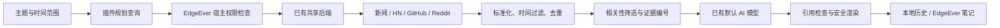

# 实现原理

[English](architecture.md)

## 各层职责

`src/sources.ts` 复制到宿主已有后端运行。所有请求使用固定 HTTPS 目的地、拒绝重定向、20 秒超时和 2 MB 响应上限，不暴露通用 URL 代理。Cloudflare 与 Docker 复用同一组 Hono 业务路由，无需专门部署研究服务或迁移数据库。

`src/engine.ts` 负责编排。快速模式用一个查询检索四个来源，每源最多六条；标准／深入模式让默认模型规划最多两个／三个查询，每源每查询最多十条。搜索请求两路并发；HN 评论补充每个查询最多增加两次请求。最终最多保留 40 条证据。

排序组合来源内排名倒数与关键词重合度，并为可用来源保留代表结果，不跨平台直接比较点赞／评论数。标准和深入模式对所有保留证据执行一次语义筛选，包括少量结果；查询始终保留原始主题，防止规划偏题。非法编号或 JSON 失败时回退本地排序。规划失败则搜索原主题。没有模型时只展示实际证据。

每条证据保存原链接、可用的发布时间、来源、摘要和覆盖标签。去重时移除追踪参数；过滤过旧和未来日期，未知日期明确保留为未知。模型的 `[E12]` 只能链接到实际取得的 E12。这验证来源对应关系，不等于验证每句话的真实性或证据是否完全支持结论。提示词要求归因标题中的主张，不能补造正文细节。

`src/ui.ts` 使用 Shadow DOM 面板、DOMPurify 和 marked。来源摘要按纯文本显示，报告排除图片与嵌入交互内容。关闭面板不会终止正在进行的研究；取消或停用插件会中止请求。重新打开应用后，遗留任务显示为已中断，不会假装自动续跑。

`src/store.ts` 串行保存本地快照。笔记通过宿主 `notes.create` 写入，重复保存会打开已有笔记。后续追问保存在历史和新导出的文件中；已经保存的笔记是当时的快照，不会被静默覆盖。追踪使用稳定命令 ID 和现有桌面调度器，每日更新固定采用标准深度；只有取得证据的研究才更新对比基线。“新证据”统计本轮不同链接，不代表新增事件。

## 宿主边界

- `context.ai.status()` 只返回是否配置以及模型显示名。
- `context.ai.generate({system, prompt, maxOutputTokens, signal})` 经已有 AI 运行层调用工作区当前默认模型。
- `context.research.search({query, source, days, limit}, {signal})` 返回结构化结果与来源状态。
- 前两者要求 `ai:generate`，搜索要求 `research:search`；插件停用后上下文调用终止。
- HTTP 路由要求交互式工作区用户身份；生成输入限制为提示词 90,000 字符、系统提示词 8,000 字符、输出 5,000 token、120 秒。供应商错误脱敏，公开演示环境禁用 AI 生成。
- 每工作区、每运行实例的 AI／读取两组请求各限制四路并发。这是并发保护，不是全局分布式配额或计费系统。

新增接口不传出 AI 密钥、Cookie、通用 HTTP 请求能力、数据库对象或内部 React 状态；仍遵循 EdgeEver 原有的可信代码插件边界。

## 后续扩展边界

新增平台适配前应先明确访问方式、限流和真实覆盖标签。全天候服务端调度需要独立产品决策，当前使用既有桌面运行环境。本地历史有限且不跨设备同步。大规模相关性评估与结论支持度验证属于后续工作；首版测试重点是来源对应、失败降级、取消、权限及 UI 安全。
